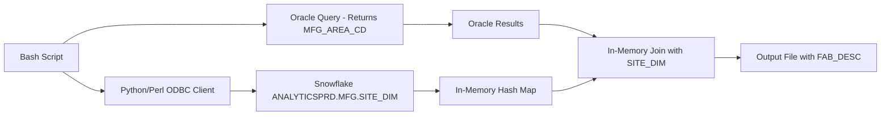
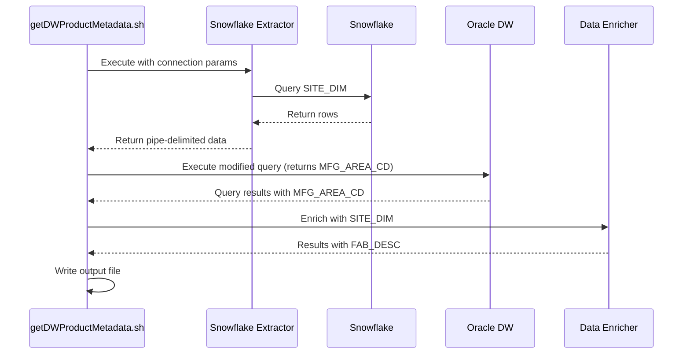

# Design Document: Snowflake SITE_DIM Migration

## Overview

This design describes the migration of SITE_DIM reference data from Oracle Data Warehouse to Snowflake in the getDWProductMetadata.sh script. The solution implements a hybrid approach where SITE_DIM data is extracted from Snowflake into memory, and the main Oracle query is modified to return MFG_AREA_CD instead of MFG_AREA_DESC. The script then performs an in-memory join to enrich the Oracle results with SITE_DIM descriptions from Snowflake.

The design follows a three-phase approach:
1. **Extract Phase**: Query Snowflake SITE_DIM and load into memory (hash map)
2. **Query Phase**: Execute modified Oracle query that returns MFG_AREA_CD
3. **Enrich Phase**: Join Oracle results with Snowflake SITE_DIM in memory to add MFG_AREA_DESC

## Architecture

### High-Level Data Flow



### Component Interaction



## Components and Interfaces

### 1. Snowflake Extractor Script

**Purpose**: Extract SITE_DIM data from Snowflake and output to stdout in pipe-delimited format.

**Implementation Options**:
- **Option A**: Python script using `pyodbc` or `snowflake-connector-python`
- **Option B**: Perl script using `DBI` with `DBD::ODBC` (consistent with existing codebase)

**Recommended**: Option B (Perl) for consistency with existing scripts like `getSnowflakeE142ModuleTrace.pl`

**Interface**:
```bash
extractSnowflakeSiteDim.pl \
  --source_odbc MART_SNOWFLAKE \
  --source_warehouse MFG_PRD_RPT_WH \
  --source_schema ANALYTICSPRD.MFG
```

**Output Format**: Pipe-delimited to stdout (no header)
```
UWA|Wafer Fab - Gresham|F
BK|Backend - Bucheon|B
CP|Backend - Cebu|B
...
```

### 2. Modified Oracle Query

**Changes Required**:
- Remove joins to `biwmarts.site_dim` in `get_fab` and `get_fab2` CTEs
- Return `MFG_AREA_CD` instead of `MFG_AREA_DESC` in the output
- Maintain all other business logic unchanged

**Affected CTEs**:
- `get_fab`: Remove SITE_DIM join, return MFG_AREA_CD
- `get_fab2`: Remove SITE_DIM join, return MFG_AREA_CD
- `get_prod`: Use MFG_AREA_CD directly
- `res`: Return MFG_AREA_CD instead of FAB_DESC

**Modified Output Columns**:
```
PRODUCT|ITEM_TYPE|FAB|FAB_CD|AFM|PROCESS|FAMILY|PACKAGE|GDPW|WF_UNITS|WF_SIZE|DIE_UNITS|DIE_WIDTH|DIE_HEIGHT|LAST_CHANGED_DATE
```
Note: `FAB_DESC` is replaced with `FAB_CD` (will be enriched later)

### 3. Data Enricher (Bash/AWK)

**Purpose**: Join Oracle results with Snowflake SITE_DIM data in memory.

**Implementation**: AWK script for efficient in-memory join

**Process**:
1. Load SITE_DIM into associative array (key: MFG_AREA_CD|FE_BE_FLG)
2. Read Oracle results line by line
3. Lookup FAB_DESC from SITE_DIM using FAB_CD
4. Output enriched row with FAB_DESC

**AWK Script**:
```awk
BEGIN {
    FS="|"
    OFS="|"
}
# Load SITE_DIM into memory (from file or stdin)
NR==FNR {
    key = $1 "|" $3  # MFG_AREA_CD|FE_BE_FLG
    site_dim[key] = $2  # MFG_AREA_DESC
    next
}
# Process Oracle results
{
    if (NR == 1) {
        # Header row - replace FAB_CD with FAB_DESC
        print $1, $2, $3, "FAB_DESC", $5, $6, $7, $8, $9, $10, $11, $12, $13, $14, $15
    } else {
        # Data row - lookup FAB_DESC
        fab_cd = $4
        fab_desc = site_dim[fab_cd "|F"]  # Assume F for front-end
        if (fab_desc == "") {
            fab_desc = site_dim[fab_cd "|B"]  # Try back-end
        }
        if (fab_desc == "") {
            fab_desc = ""  # Not found
        }
        print $1, $2, $3, fab_desc, $5, $6, $7, $8, $9, $10, $11, $12, $13, $14, $15
    }
}
```

## Data Models

### SITE_DIM Schema

| Column | Type | Description | Nullable |
|--------|------|-------------|----------|
| MFG_AREA_CD | VARCHAR2(50) | Manufacturing area code (e.g., 'UWA', 'BK') | No |
| MFG_AREA_DESC | VARCHAR2(200) | Manufacturing area description | Yes |
| FE_BE_FLG | VARCHAR2(1) | Front-end/Back-end flag ('F' or 'B') | No |

**Primary Key**: (MFG_AREA_CD, FE_BE_FLG)

### Temporary File Format

**Delimiter**: Pipe (|)
**Header**: Required (first line)
**Encoding**: UTF-8
**Line Terminator**: LF (\n) or CRLF (\r\n)

**Example**:
```
MFG_AREA_CD|MFG_AREA_DESC|FE_BE_FLG
UWA|Wafer Fab - Gresham|F
BK|Backend - Bucheon|B
CP|Backend - Cebu|B
```

## Implementation Details

### Script Modifications

#### 1. Add Snowflake Parameters

```bash
# New parameters (optional, with defaults)
snowflake_odbc="${6:-MART_SNOWFLAKE}"
snowflake_warehouse="${7:-MFG_PRD_RPT_WH}"
snowflake_schema="${8:-ANALYTICSPRD.MFG}"
```

#### 2. Extract SITE_DIM from Snowflake

```bash
# Define temporary file for SITE_DIM
siteDimFile="$tmpDir/site_dim_${dateCode}.dat"

# Execute Snowflake extractor and capture output
echo "Extracting SITE_DIM from Snowflake..." >> $logFile
perl scripts/extractSnowflakeSiteDim.pl \
  --source_odbc "$snowflake_odbc" \
  --source_warehouse "$snowflake_warehouse" \
  --source_schema "$snowflake_schema" \
  > "$siteDimFile"

if [ $? -ne 0 ]; then
  echo "ERROR: Failed to extract SITE_DIM from Snowflake" >&2
  exit 1
fi

# Validate file exists and has data
if [ ! -f "$siteDimFile" ] || [ ! -s "$siteDimFile" ]; then
  echo "ERROR: SITE_DIM file is missing or empty" >&2
  exit 1
fi

# Log row count
rowCount=$(wc -l < "$siteDimFile")
echo "SITE_DIM extracted: $rowCount rows" >> $logFile
```

#### 3. Modify Oracle Query

Remove SITE_DIM joins and return MFG_AREA_CD:

**In `get_fab` CTE - Remove**:
```sql
inner join biwmarts.site_dim compnt_sd
    on compnt_sd.MFG_AREA_CD = WU.BOM_COMPNT_MFG_AREA_CD
    and compnt_sd.FE_BE_FLG  = WU.BOM_COMPNT_FE_BE_FLG
```

**In `get_fab` CTE - Remove**:
```sql
compnt_sd.MFG_AREA_DESC as BOM_COMPNT_MFG_AREA_DESC,
```

**In `get_fab2` CTE - Same changes**

**In `res` CTE - Change**:
```sql
-- Before:
, max(CASE WHEN PDPW_VAL IS NULL OR PDPW_VAL = 0 THEN NULL ELSE FAB_NAME END) AS FAB_DESC

-- After:
, max(CASE WHEN PDPW_VAL IS NULL OR PDPW_VAL = 0 THEN NULL ELSE FAB_CD END) AS FAB_CD
```

**In final SELECT - Change**:
```sql
-- Before:
||'|'||SUBSTR(FAB_DESC, 1, 50)

-- After:
||'|'||FAB_CD
```

#### 4. Enrich Results with SITE_DIM

```bash
# Create AWK script for enrichment
enrichScript="$tmpDir/enrich_${dateCode}.awk"
cat << 'EOF' > "$enrichScript"
BEGIN {
    FS="|"
    OFS="|"
}
# Load SITE_DIM into memory
NR==FNR {
    key = $1 "|" $3  # MFG_AREA_CD|FE_BE_FLG
    site_dim[key] = $2  # MFG_AREA_DESC
    next
}
# Process Oracle results
{
    if (NR == FNR + 1) {
        # Header row
        print $1, $2, $3, "FAB_DESC", $5, $6, $7, $8, $9, $10, $11, $12, $13, $14, $15
    } else {
        # Data row - lookup FAB_DESC
        fab_cd = $4
        fab_desc = ""
        if (fab_cd != "" && fab_cd != " ") {
            # Try front-end first
            fab_desc = site_dim[fab_cd "|F"]
            if (fab_desc == "") {
                # Try back-end
                fab_desc = site_dim[fab_cd "|B"]
            }
        }
        print $1, $2, $3, substr(fab_desc, 1, 50), $5, $6, $7, $8, $9, $10, $11, $12, $13, $14, $15
    }
}
EOF

# Enrich Oracle results with SITE_DIM
awk -f "$enrichScript" "$siteDimFile" "$outFileTmp" > "$outFile"

# Cleanup
rm -f "$enrichScript" "$siteDimFile"
```

### Snowflake Extractor Implementation (Perl)

```perl
#!/usr/bin/perl
use strict;
use warnings;
use DBI;
use Getopt::Long;

my ($sourceODBC, $sourceWarehouse, $sourceSchema);

GetOptions(
    "source_odbc=s"      => \$sourceODBC,
    "source_warehouse=s" => \$sourceWarehouse,
    "source_schema=s"    => \$sourceSchema
) or die "Invalid options\n";

# Get credentials from environment
my $snowUser = $ENV{SNOW_USER} or die "SNOW_USER not set\n";
my $snowPass = $ENV{SNOW_PASS} or die "SNOW_PASS not set\n";

# Connect to Snowflake
my $dbh = DBI->connect("dbi:ODBC:$sourceODBC", $snowUser, $snowPass, {
    PrintError => 0,
    RaiseError => 1
}) or die "Cannot connect: $DBI::errstr\n";

# Set warehouse
$dbh->do("USE WAREHOUSE $sourceWarehouse");

# Query SITE_DIM
my $sql = "SELECT MFG_AREA_CD, MFG_AREA_DESC, FE_BE_FLG FROM $sourceSchema.SITE_DIM ORDER BY MFG_AREA_CD, FE_BE_FLG";
my $sth = $dbh->prepare($sql);
$sth->execute();

# Write to stdout (no header)
while (my $row = $sth->fetchrow_arrayref()) {
    print join('|', map { defined $_ ? $_ : '' } @$row) . "\n";
}

$sth->finish();
$dbh->disconnect();

exit 0;
```

## Error Handling

### Error Scenarios and Responses

| Error Scenario | Detection | Response | Exit Code |
|----------------|-----------|----------|-----------|
| Snowflake connection failure | DBI connect fails | Log error, exit | 1 |
| SITE_DIM query failure | Query execution fails | Log error, exit | 1 |
| Empty SITE_DIM result | Row count = 0 | Log error, exit | 1 |
| Oracle query failure | Oracle query fails | Log error, exit | 1 |
| Enrichment failure | AWK script fails | Log error, exit | 1 |

### Cleanup on Error

```bash
cleanup() {
    # Remove temporary files
    [ -f "$siteDimFile" ] && rm -f "$siteDimFile"
    [ -f "$enrichScript" ] && rm -f "$enrichScript"
    [ -f "$tmpScript" ] && rm -f "$tmpScript"
}

trap cleanup EXIT
```

## Testing Strategy

### Unit Testing

1. **Test Snowflake Extractor**:
   - Test with valid credentials
   - Test with invalid credentials (expect failure)
   - Test with empty SITE_DIM table (expect error)
   - Test file output format validation

2. **Test External Table Creation**:
   - Test with valid file
   - Test with missing file (expect failure)
   - Test with malformed file (expect failure)

3. **Test Main Query**:
   - Compare output with original script using Oracle SITE_DIM
   - Verify row counts match
   - Verify FAB_DESC values match

### Integration Testing

1. **End-to-End Test**:
   - Run script with all three product-like patterns
   - Verify output files are identical to baseline
   - Verify execution time is acceptable

2. **Error Recovery Test**:
   - Simulate Snowflake connection failure
   - Verify cleanup occurs
   - Verify error messages are clear

### Property-Based Testing

Property tests are not applicable for this migration as it involves infrastructure changes rather than algorithmic logic.

## Logging

### Log Entries

```
[TIMESTAMP] Starting SITE_DIM extraction from Snowflake
[TIMESTAMP] Connecting to Snowflake: MART_SNOWFLAKE, warehouse: MFG_PRD_RPT_WH
[TIMESTAMP] Querying ANALYTICSPRD.MFG.SITE_DIM
[TIMESTAMP] SITE_DIM extraction: 45 rows written to /tmp/site_dim_20260209_143022.dat
[TIMESTAMP] Creating Oracle external table TEMP_SITE_DIM
[TIMESTAMP] Executing main product metadata query
[TIMESTAMP] Query completed: 1234 products extracted
[TIMESTAMP] Dropping external table TEMP_SITE_DIM
[TIMESTAMP] Total execution time: 125 seconds
```

### Log Levels

- **INFO**: Normal operation milestones
- **WARN**: Non-fatal issues (e.g., null values in SITE_DIM)
- **ERROR**: Fatal errors requiring script termination

## Performance Considerations

### Expected Performance Impact

1. **SITE_DIM Extraction**: ~2-5 seconds (small table, ~50 rows)
2. **Oracle Query**: Slightly faster (no SITE_DIM join)
3. **In-Memory Enrichment**: <1 second (AWK is very fast for small datasets)
4. **Overall**: Comparable or slightly faster than original

### Optimization Opportunities

1. **Cache SITE_DIM**: If script runs multiple times per day, cache SITE_DIM file for 24 hours
2. **Parallel Execution**: Extract SITE_DIM in background while Oracle query runs

### Memory Usage

- SITE_DIM in memory: ~50 rows × 250 bytes = ~12.5 KB (negligible)
- AWK associative array overhead: ~50 KB total
- No memory concerns for this approach

## Deployment

### Prerequisites

1. Snowflake ODBC driver installed on execution host
2. ODBC DSN `MART_SNOWFLAKE` configured
3. Environment variables `SNOW_USER` and `SNOW_PASS` set
4. Perl DBI and DBD::ODBC modules installed
5. AWK available (standard on Unix/Linux systems)

### Deployment Steps

1. Create `extractSnowflakeSiteDim.pl` script in `scripts/` directory
2. Update `getDWProductMetadata.sh` with modifications
3. Test in development environment
4. Deploy to production
5. Monitor first production runs

### Rollback Plan

If issues arise:
1. Revert `getDWProductMetadata.sh` to previous version
2. Script will use Oracle BIWMARTS.SITE_DIM as before
3. No data loss or corruption risk

## Security Considerations

1. **Credentials**: Snowflake credentials stored in environment variables (not in script)
2. **Temporary Files**: Created in secure directory with restricted permissions
3. **SQL Injection**: No user input in SQL queries (all parameters are validated)
4. **File Permissions**: Temporary files should be readable only by the executing user
5. **No Oracle Privileges Required**: No need for CREATE TABLE or directory object permissions

## Backward Compatibility

This migration changes the data source but maintains:
- Same command-line interface (new parameters are optional)
- Same output format
- Same file naming convention
- Same exit codes

Existing cron jobs and automation will continue to work without modification.
