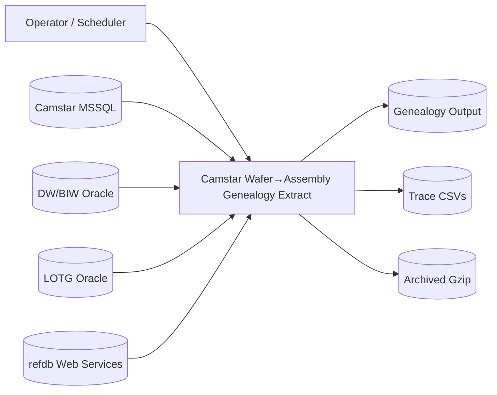

# Data Flow Diagram (DFD): n_getCamstarWafer2AssemblyGenealogy.pl

## Purpose
Generate wafer-to-assembly genealogy and trace CSV files by combining Camstar consumption data with reference lookups (LOTG/DW and refdb web services).

## External Entities
- **Operator / Scheduler**: Launches the script with parameters.
- **Camstar MSSQL (per site)**: Primary source of wafer consumption data.
- **LOTG Oracle**: Reference lot genealogy lookup (fallback).
- **DW Oracle**: Reference metadata (fab codes) lookup.
- **refdb Web Services**:
  - `onlot/bylotid` for source lot resolution
  - `pplotprod/bylotid` for fab/source lot (Fairchild sites)

## Data Stores
- **DS1: Camstar MSSQL** (per site DSN): Consumption history, material lots, scribe, quantities.
- **DS2: DW/BIW** (Oracle): Fab codes/description table.
- **DS3: LOTG** (Oracle): Lot genealogy lookup.
- **DS4: Local Output (Genealogy)**: Wafer→Assembly genealogy file (no header).
- **DS5: Local Output (Trace)**: Class50 trace CSVs with header.
- **DS6: Archive (Genealogy/Trace)**: Gzipped copies for archive.

## Level 0 (Context Diagram)
**Process P0: Camstar Wafer→Assembly Genealogy Extract**
- Inputs: CLI params, Camstar consumption data, DW fab codes, LOTG genealogy, refdb WS lookups.
- Outputs: Genealogy file and trace CSV(s), archived gz files, logs.

## Level 1 (Decomposition)
### P1: Initialize & Validate
- Read CLI arguments: `SOURCE_DB`, `SOURCE_WAREHOUSE`, `SOURCE_SCHEMA`, `START_HOURS`, `END_HOURS`, output dirs.
- Validate output and archive directories; create temp subfolders.
- Initialize logging.

### P2: Reference Data Load
- Query DW (BIW) to load **fab codes** into memory (`%fabCodes`).

### P3: Fetch Camstar Consumption Records
- Connect to **Camstar MSSQL** using site-specific DSN/credentials.
- Execute site-specific SQL (`getSQL($sourceDB)`), yielding rows with:
  - Assembly lot, material lot, consumption quantities, dates, scribe, part names, etc.

### P4: Resolve Source Lots & Wafer IDs
For each Camstar row:
- **Resolve assembly source lot** using:
  - cached lookup
  - refdb `onlot` WS
  - LOTG fallback if WS returns no data
- **Resolve fab source lot** and fab ID using:
  - Camstar attributes (common sites)
  - refdb `pplotprod` WS for Fairchild sites
  - LOTG fallback if needed
- Normalize wafer IDs and scribe info; apply site-specific fixes.

### P5: Build Genealogy & Trace Records
- Construct **genealogy records** keyed by event name and timestamp.
- Construct **trace records** (Class50) keyed by `assemblyLot + exensioWafer`.

### P6: Write Outputs
- **Genealogy file**: one file per run, no header.
- **Trace files**: multiple CSVs per assembly lot / fab source lot, with header.

### P7: Archive Outputs
- Gzip outputs into configured archive locations.

## Data Flows
1. **Operator → P1**: CLI parameters.
2. **P1 → P2**: Request fab codes.
3. **DW/BIW → P2 → P4**: Fab code lookup data.
4. **P1 → P3**: Source DB selection.
5. **Camstar MSSQL → P3 → P4**: Consumption rows.
6. **P4 ↔ refdb WS**: Source lot / fab resolution.
7. **P4 ↔ LOTG**: Fallback genealogy lookups.
8. **P5 → DS4/DS5**: Output files.
9. **P6 → DS6**: Archived gzip copies.

## Key Transformations / Business Rules
- Source lot determination differs by site (Cebu/Suzhou parsing vs. others).
- Fairchild fabs use `pplotprod` WS; LOTG fallback when WS is missing or inconsistent.
- Special handling for scribe IDs with multiple spaces and site-specific wafer ID normalization.
- Prevent invalid genealogy links (exclude substrate/epi, merge parents, etc.).

## Outputs
- **Genealogy file** (no header):
  `EVENT_TYPE|STEP|EVENT_TIME|EVENT_NAME|SRC_LOT|LOT|LOT_TYPE|PROD|PART_CNT|FROM_FAB|FROM_PROD|FROM_SRC_LOT|FROM_LOT|WAFERS|WF_NUMS`
- **Trace files** (Class50 header):
  `LOT|ASSEMBLY_PART_COUNT|SOURCE_LOT|LOT_TYPE|PRODUCT|CONSUMPTION_DATE|FROM_PRODUCT|FROM_EXENSIO_SOURCE_LOT|FROM_EXENSIO_WAFER_ID|FROM_WAFER_NUMBER|FROM_FAB|FROM_INVENTORY_LOT|FROM_WAFER_SCRIBE|QTY_CONSUMED|QTY_REQUIRED|CONSUME_FACTOR|MATERIAL_LOT|ASSEMBLY_STEP`

## Notes
- One run uses a single `SOURCE_DB` and produces two output types.
- Web service responses are cached in memory to reduce repeated lookups.
- Errors in WS/LOTG are logged; fallback paths attempt to preserve output continuity.
