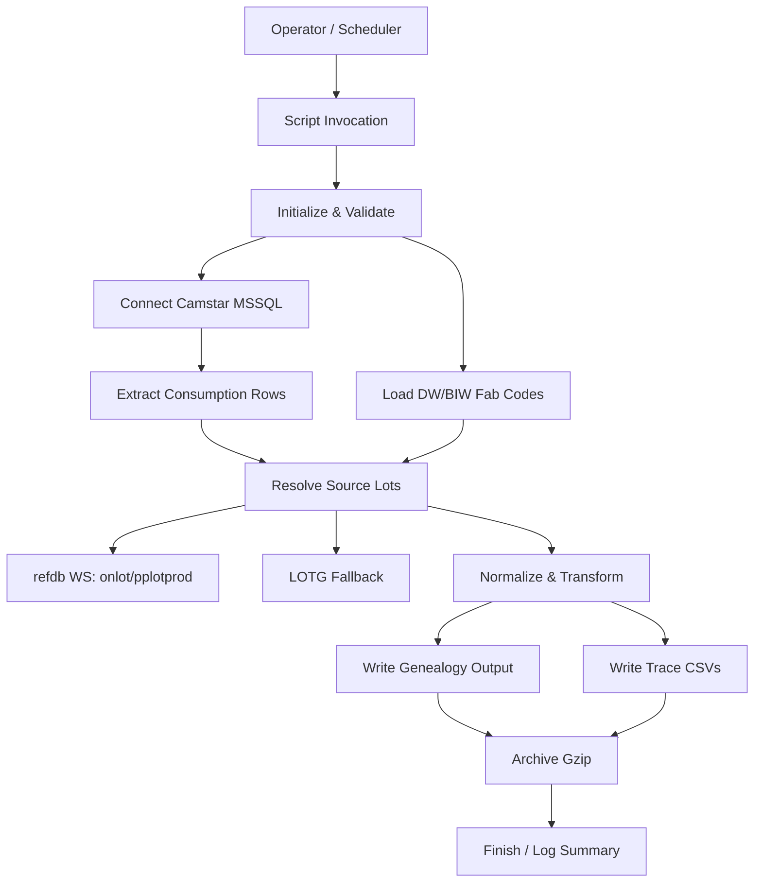

# System Flow: n_getCamstarWafer2AssemblyGenealogy.pl

## Overview
System flow for the end-to-end execution of `n_getCamstarWafer2AssemblyGenealogy.pl`, from invocation through data extraction, enrichment, output generation, and archival.

## Flow (High-Level)
1. **Invoke Script**
   - Operator or scheduler calls the script with `SOURCE_DB`, time window, and output/archive locations.
2. **Initialize & Validate**
   - Validate parameters, create temp/output folders, initialize logging.
3. **Load Reference Data**
   - Query DW/BIW for fab codes and cache in memory.
4. **Extract Camstar Consumption**
   - Connect to site-specific Camstar MSSQL and execute site SQL.
5. **Resolve Source Lots / Fab IDs**
   - Use cached lookups, refdb web services (`onlot`, `pplotprod`), and LOTG fallback to resolve genealogy and fab info.
6. **Transform & Normalize**
   - Normalize wafer IDs/scribe; apply site-specific rules.
7. **Generate Outputs**
   - Build genealogy records (no header) and trace CSVs (Class50 header).
8. **Archive Outputs**
   - Gzip genealogy/trace outputs into archive locations.
9. **Finish**
   - Log summary and exit with status.

## System Flow Diagram (Mermaid)

## Interfaces
- **Inputs**: CLI params, Camstar MSSQL data, DW/BIW fab codes, refdb WS, LOTG.
- **Outputs**: Genealogy file (no header), Trace CSVs (Class50 header), gzipped archives, logs.

## Notes
- Web service results are cached per run to minimize repeated calls.
- LOTG acts as fallback when refdb is missing or inconsistent.
- Site-specific rules affect lot parsing and wafer normalization.
