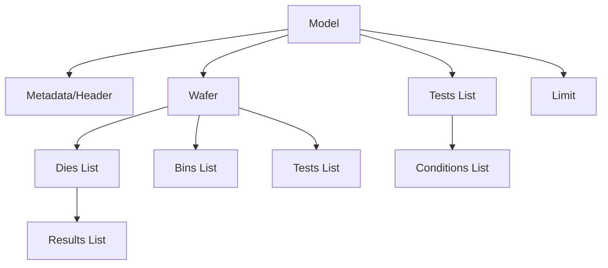

# SHEDCL DTS1000 XLS Parser - Python Implementation Design Document

## Overview

This document outlines the design for converting the Perl parser `Dts_2k_xls.pm` to Python (`Dts1000XlsParser.py`), with enhanced capabilities for custom parsing injection.

## Background

The original Perl parser processes Excel files from the **SHEDCL DTS1000** semiconductor tester (manufactured by JUNO/Shanghai Youneng Electronics). The DTS1000 is a discrete device test system used for high-speed testing and sorting of transistors, MOSFETs, and diodes. The parser extracts test data, metadata, and bin information from Excel output files. The Python version will maintain compatibility while adding flexibility for custom field parsing.

---

## Data Structure Mapping

### Perl to Python Class Mapping

| Perl Module | Python Class | Purpose |
|------------|--------------|---------|
| `PDF::DpData::Model` | `lib.Data.Model.Model` | Root data container |
| `PDF::DpData::Wafer` | `lib.Data.Wafer.Wafer` | Wafer-level data |
| `PDF::DpData::Test` | `lib.Data.Test.Test` | Test parameter definitions |
| `PDF::DpData::Die` | `lib.Data.Die.Die` | Individual die results |
| `PDF::DpData::Bin` | `lib.Data.Bin.Bin` | Bin definitions and counts |
| `PDF::DpData::Limit` | `lib.Data.Limit.Limit` | Test limits |
| `PDF::DpData::Header` | `lib.Data.Metadata.Metadata` | Lot/test metadata |

### Python Data Structure Hierarchy



### Key Data Classes

#### Model Class
```python
class Model(Base):
    ATTRS = ["header", "wmap", "limit", "misc", "dataSource", ...]
    _arrays = {
        "wafers": [],
        "tests": [],
        "sbins": [],
        "hbins": [],
        "dies": [],
        ...
    }
```

#### Metadata (Header) Class
```python
class Metadata(Base):
    # Key attributes for DTS 2K parser
    ATTRS = [
        "PROGRAM", "REVISION", "PRODUCT", "LOT", 
        "OPERATOR", "EQUIP1_ID", "START_TIME", "END_TIME",
        "PROCESS", "RECIPE", ...
    ]
```

#### Wafer Class
```python
class Wafer(Base):
    ATTRS = ["key", "number", "START_TIME", "END_TIME", "name"]
    _arrays = {
        "tests": [],
        "bins": [],
        "dies": [],
        ...
    }
```

#### Test Class
```python
class Test(Base):
    ATTRS = [
        "name", "number", "units", 
        "LSL", "HSL",  # Low/High Spec Limits
        "critical", "group", ...
    ]
    _arrays = {
        "conditions": []  # Bias conditions
    }
```

#### Die Class
```python
class Die(Base):
    ATTRS = ["partid", "x", "y", "soft_bin", "hard_bin", ...]
    _arrays = {
        "result": []  # Test results in order
    }
```

#### Bin Class
```python
class Bin(Base):
    ATTRS = ["number", "name", "PF", "count", ...]
```

---

## Custom Parsing Injection Strategy

### Design Pattern: Strategy Pattern with Callbacks

The parser will support custom field extraction through a **callback-based injection system**.

### Implementation Approach

#### 1. Parser Configuration Class

```python
class ParserConfig:
    """Configuration for custom parsing behavior"""
    
    def __init__(self):
        self.custom_extractors = {
            'lot_parser': None,
            'device_parser': None,
            'time_parser': None,
            'program_parser': None,
            'process_parser': None,
        }
        
    def register_extractor(self, field_name: str, callback: Callable):
        """Register a custom extraction function"""
        self.custom_extractors[field_name] = callback
```

#### 2. Custom Extractor Interface

```python
from typing import Dict, Any, Optional, Callable

class CustomExtractor:
    """Base class for custom field extractors"""
    
    @staticmethod
    def extract(raw_data: Dict[str, Any], context: Dict[str, Any]) -> Any:
        """
        Extract custom field from raw data
        
        Args:
            raw_data: Raw cell values from Excel
            context: Parser context (file info, previous values, etc.)
            
        Returns:
            Extracted value
        """
        raise NotImplementedError
```

#### 3. Specific Custom Extractors

##### Lot ID Parser (Example from Requirements)

```python
class LotIdExtractor(CustomExtractor):
    """
    Extract lot components from format: FT-FCPF250N65S3L1-F154-HVPFT160003
    Maps to:
        - FT -> Final Test process
        - FCPF250N65S3L1 -> Device name
        - F154 -> Internal control naming
        - HVPFT160003 -> Lot ID
    """
    
    @staticmethod
    def extract(raw_data: Dict[str, Any], context: Dict[str, Any]) -> Dict[str, str]:
        lot_string = raw_data.get('LotName', '')
        
        # Pattern: PROCESS-DEVICE-CONTROL-LOTID
        pattern = r'^([A-Z]+)-([A-Z0-9]+)-([A-Z0-9]+)-([A-Z0-9]+)$'
        match = re.match(pattern, lot_string)
        
        if match:
            return {
                'PROCESS': match.group(1),  # FT = Final Test
                'PRODUCT': match.group(2),  # Device name
                'INTERNAL_CONTROL': match.group(3),
                'LOT': match.group(4),
            }
        
        # Fallback to original value
        return {'LOT': lot_string}
```

##### Test Program Parser

```python
class TestProgramExtractor(CustomExtractor):
    """
    Extract test program and revision from TestFilename
    Last character is the revision
    """
    
    @staticmethod
    def extract(raw_data: Dict[str, Any], context: Dict[str, Any]) -> Dict[str, str]:
        test_filename = raw_data.get('TestFileName', '')
        
        # Extract basename without path and extension
        basename = os.path.splitext(os.path.basename(test_filename))[0]
        
        if len(basename) > 0:
            program = basename[:-1] if len(basename) > 1 else basename
            revision = basename[-1] if len(basename) > 1 else ''
            
            return {
                'PROGRAM': program,
                'REVISION': revision,
            }
        
        return {'PROGRAM': basename, 'REVISION': ''}
```

##### Time Extractor (from Dataport file modified date)

```python
class DataportTimeExtractor(CustomExtractor):
    """
    Use file modified timestamp instead of 1/1/1970
    """
    
    @staticmethod
    def extract(raw_data: Dict[str, Any], context: Dict[str, Any]) -> Dict[str, str]:
        file_path = context.get('input_file', '')
        
        if os.path.exists(file_path):
            mod_time = os.path.getmtime(file_path)
            dt = datetime.fromtimestamp(mod_time)
            formatted_time = dt.strftime('%Y/%m/%d %H:%M:%S')
            
            return {
                'START_TIME': formatted_time,
                'END_TIME': formatted_time,
            }
        
        # Fallback to parsing from file
        return {}
```

---

## Parser Architecture

### Main Parser Class

```python
class Dts1000XlsParser:
    """
    Parser for SHEDCL DTS1000 (JUNO) Excel format test data
    """
    
    def __init__(self, config: Optional[ParserConfig] = None):
        self.config = config or ParserConfig()
        self.logger = Log()
        
    def parse_to_model(self, infile: str) -> Model:
        """
        Main parsing method
        
        Args:
            infile: Path to Excel file
            
        Returns:
            Model object with parsed data
        """
        # Initialize model
        model = Model({
            'header': Metadata(),
            'misc': {},
            'dataSource': 'JUNO'
        })
        
        # Initialize wafer
        wafer = Wafer({'number': 0})
        model.add('wafers', wafer)
        
        # Parse Excel file
        workbook = self._load_excel(infile)
        worksheet = workbook.worksheets[0]
        
        # Parse with custom extractors
        context = {'input_file': infile}
        self._parse_worksheet(worksheet, model, wafer, context)
        
        # Build limits
        model.build_limit()
        
        return model
    
    def _parse_worksheet(self, worksheet, model, wafer, context):
        """Parse worksheet rows with custom extraction"""
        
        test_names = []
        hi_limits = []
        lo_limits = []
        hi_units = []
        lo_units = []
        bias_conditions = []
        data_flag = False
        bin_counts = {}
        
        for row_idx, row in enumerate(worksheet.iter_rows(values_only=True)):
            row_data = [self._clean_string(cell) for cell in row]
            
            # Apply custom extractors for metadata rows
            self._extract_metadata(row_data, model.header, context)
            
            # Parse test definitions
            if self._is_test_header(row_data):
                test_names = row_data[2:]
                
            elif self._is_bias_row(row_data):
                self._parse_bias(row_data, bias_conditions)
                
            elif self._is_limit_row(row_data, 'Min'):
                self._parse_limits(row_data, lo_limits, lo_units)
                
            elif self._is_limit_row(row_data, 'Max'):
                self._parse_limits(row_data, hi_limits, hi_units)
                
            elif self._is_data_header(row_data):
                data_flag = True
                
            elif data_flag and self._is_data_row(row_data):
                self._parse_die_data(row_data, wafer, test_names, bin_counts)
        
        # Create test objects
        self._create_tests(model, wafer, test_names, lo_limits, hi_limits, 
                          lo_units, hi_units, bias_conditions)
        
        # Create bin objects
        self._create_bins(wafer, bin_counts)
    
    def _extract_metadata(self, row_data, header, context):
        """Extract metadata with custom extractors"""
        
        if not row_data or len(row_data) < 3:
            return
        
        field_name = row_data[0]
        field_value = row_data[2] if len(row_data) > 2 else ''
        
        # Standard field mapping
        field_map = {
            'Date': self._parse_date_field,
            'Version': lambda v: setattr(header, 'REVISION', v),
            'Station': lambda v: context.update({'station': v}),
            'SystemName': lambda v: self._set_equipment(header, v, context),
            'DeviceName': lambda v: setattr(header, 'PRODUCT', v),
            'LotName': lambda v: self._parse_lot_field(header, v, context),
            'OperatorName': lambda v: setattr(header, 'OPERATOR', v),
            'TestFileName': lambda v: self._parse_program_field(header, v, context),
        }
        
        # Apply standard or custom extractor
        if field_name in field_map:
            if field_name in self.config.custom_extractors and \
               self.config.custom_extractors[field_name]:
                # Use custom extractor
                custom_data = self.config.custom_extractors[field_name](
                    {'field': field_name, 'value': field_value}, 
                    context
                )
                for key, val in custom_data.items():
                    setattr(header, key, val)
            else:
                # Use standard extractor
                field_map[field_name](field_value)
    
    def _parse_lot_field(self, header, lot_value, context):
        """Parse lot field with optional custom extractor"""
        
        if 'lot_parser' in self.config.custom_extractors and \
           self.config.custom_extractors['lot_parser']:
            # Use custom lot parser
            result = self.config.custom_extractors['lot_parser'](
                {'LotName': lot_value}, 
                context
            )
            for key, val in result.items():
                setattr(header, key, val)
        else:
            # Default behavior
            header.LOT = lot_value
```

---

## Usage Example

### Standard Usage (No Custom Parsing)

```python
from lib.Parser.Dts1000XlsParser import Dts1000XlsParser

parser = Dts1000XlsParser()
model = parser.parse_to_model('test_data.xls')

print(f"Lot: {model.header.LOT}")
print(f"Product: {model.header.PRODUCT}")
print(f"Tests: {len(model.tests)}")
```

### Custom Parsing Usage

```python
from lib.Parser.Dts1000XlsParser import Dts1000XlsParser, ParserConfig
from lib.Parser.CustomExtractors import (
    LotIdExtractor, 
    TestProgramExtractor,
    DataportTimeExtractor
)

# Configure custom extractors
config = ParserConfig()
config.register_extractor('lot_parser', LotIdExtractor.extract)
config.register_extractor('program_parser', TestProgramExtractor.extract)
config.register_extractor('time_parser', DataportTimeExtractor.extract)

# Parse with custom extractors
parser = Dts1000XlsParser(config)
model = parser.parse_to_model('FT-FCPF250N65S3L1-F154-HVPFT160003.xls')

# Results will have custom-parsed fields
print(f"Process: {model.header.PROCESS}")  # 'FT' (Final Test)
print(f"Device: {model.header.PRODUCT}")   # 'FCPF250N65S3L1'
print(f"Lot ID: {model.header.LOT}")       # 'HVPFT160003'
print(f"Program: {model.header.PROGRAM}")  # Test program name
print(f"Revision: {model.header.REVISION}") # Last character
```

---

## Implementation Plan

### Phase 1: Core Parser Structure
1. Create `Dts1000XlsParser.py` class
2. Implement Excel file loading with `openpyxl`
3. Implement basic row parsing logic
4. Map to Python data structures

### Phase 2: Standard Field Extraction
1. Implement metadata extraction (Date, Version, Station, etc.)
2. Implement test definition parsing (names, limits, units, bias)
3. Implement die data parsing
4. Implement bin counting and creation

### Phase 3: Custom Injection Framework
1. Create `ParserConfig` class
2. Create `CustomExtractor` base class
3. Implement extractor registration mechanism
4. Integrate custom extractors into parsing flow

### Phase 4: Specific Custom Extractors
1. Implement `LotIdExtractor` (FT-DEVICE-CONTROL-LOT pattern)
2. Implement `TestProgramExtractor` (program + revision)
3. Implement `DataportTimeExtractor` (file modified time)

### Phase 5: Testing & Validation
1. Unit tests for each extractor
2. Integration tests with sample files
3. Comparison with Perl parser output

---

## Best-Fit Python Data Structures

### Collections Used

| Purpose | Python Structure | Rationale |
|---------|------------------|-----------|
| Test list | `list[Test]` | Ordered, indexed by test number |
| Die results | `list[float/str]` | Ordered, matches test order |
| Bins | `list[Bin]` | Small collection, need iteration |
| Bin counts | `dict[int, int]` | Fast lookup by bin number |
| Metadata fields | Class attributes | Type-safe, IDE-friendly |
| Custom extractors | `dict[str, Callable]` | Dynamic registration |

### Why These Structures?

- **Lists for ordered data**: Tests and results must maintain order for alignment
- **Dictionaries for lookups**: Bin counts, custom extractors need fast access
- **Class attributes**: Strongly typed, matches existing Python codebase patterns
- **Base class pattern**: Consistent with existing `lib.Data` classes

---

## File Organization

```
scripts/py/lib/
├── Parser/
│   ├── Dts1000XlsParser.py         # Main parser class
│   ├── CustomExtractors.py         # Custom extractor implementations
│   └── ParserConfig.py             # Configuration class
└── Data/
    ├── Model.py                    # Existing
    ├── Wafer.py                    # Existing
    ├── Test.py                     # Existing
    ├── Die.py                      # Existing
    ├── Bin.py                      # Existing
    └── Metadata.py                 # Existing
```

---

## Dependencies

```python
# Standard library
import os
import re
from datetime import datetime
from typing import Dict, Any, Optional, Callable, List

# Third-party
import openpyxl  # Excel file parsing (replaces Spreadsheet::ParseExcel)

# Internal
from lib.Data.Model import Model
from lib.Data.Wafer import Wafer
from lib.Data.Test import Test
from lib.Data.Die import Die
from lib.Data.Bin import Bin
from lib.Data.Metadata import Metadata
from lib.Log import Log
from lib.Util import Util
```

---

## Key Differences from Perl Version

| Aspect | Perl | Python |
|--------|------|--------|
| Excel library | `Spreadsheet::ParseExcel` | `openpyxl` |
| String handling | Regex with `=~` | `re` module |
| Object creation | `new_*` functions | Class constructors |
| Array handling | `@array` | `list` |
| Hash handling | `%hash` | `dict` |
| Custom parsing | Not supported | Callback-based injection |

---

## Summary

This design provides:

1. **Full compatibility** with existing Python data structures
2. **Flexible custom parsing** through callback injection
3. **Clean separation** between standard and custom extraction
4. **Extensibility** for future custom field requirements
5. **Type safety** through Python type hints
6. **Maintainability** through clear class organization

The custom injection strategy allows users to override specific field parsing without modifying the core parser, making it ideal for handling variations in data formats across different test sites or equipment.
