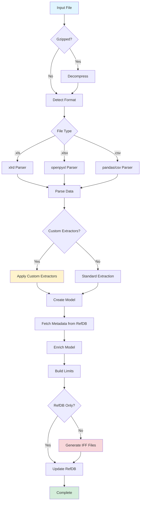

# DTS1000 JUNO Translator/Enricher - Usage Guide

## Overview

The `dts1000_juno_translator_enricher.py` script processes DTS1000/DTS2000 (JUNO) test data files and converts them to IFF format with metadata enrichment from RefDB.

**Key Features**:
- ✅ Supports `.xls`, `.xlsx`, and `.csv` files
- ✅ Automatic format detection and optimized loading
- ✅ Optional custom field extractors (lot ID, program, timestamps)
- ✅ Metadata enrichment from RefDB
- ✅ IFF output generation
- ✅ Gzip support for compressed files
- ✅ Comprehensive logging

---

## File Location

```
scripts/py/dts1000_juno_translator_enricher.py
```

---

## Basic Usage

### Minimal Command

```bash
python dts1000_juno_translator_enricher.py \
  --infile /path/to/test_data.xls \
  --out /path/to/outbox \
  --site SITE_NAME \
  --ws_source prod \
  --metadata_source ERT
```

### Required Parameters

| Parameter | Description | Example |
|-----------|-------------|---------|
| `--infile` | Input file path (.xls, .xlsx, .csv, or .gz) | `data.xls` |
| `--out` | Output directory for IFF files | `/outbox` |
| `--site` | Site name (from config) | `PHXFT` |
| `--ws_source` | Web service source | `prod`, `qa`, `dev` |
| `--metadata_source` | Metadata source | `ERT` or `REFDB` |

---

## Optional Parameters

### Custom Extractors

Enable custom field extraction:

| Parameter | Description | Default |
|-----------|-------------|---------|
| `--custom_lot_parser` | Parse lot ID as PROCESS-DEVICE-CONTROL-LOT | `False` |
| `--custom_program_parser` | Extract program name and revision from filename | `False` |
| `--use_file_time` | Use file modification time for timestamps | `False` |

### Database & Logging

| Parameter | Description | Default |
|-----------|-------------|---------|
| `--env` | RefDB environment | Auto-detect |
| `--pplog` | Log to refdb.pp_log | `False` |
| `--logfile` | Custom log file path | Auto-generated |
| `--refdb_only` | Skip IFF generation, only update RefDB | `False` |
| `--force_prd` | Force production load even without metadata | `False` |

### Configuration

| Parameter | Description | Default |
|-----------|-------------|---------|
| `--config_file` | YAML configuration file | `xFCS_FACILITY_MAPPING.yaml` |

---

## Usage Examples

### Example 1: Standard Parsing (No Custom Extractors)

```bash
python dts1000_juno_translator_enricher.py \
  --infile /inbox/test_data.xls \
  --out /outbox \
  --site PHXFT \
  --ws_source prod \
  --metadata_source ERT
```

**Output**:
- Parses file with default field extraction
- Lot ID → `LOT` field
- Program → basename of TestFileName
- Timestamps → from Date row in Excel

---

### Example 2: Custom Lot ID Parsing

For lot format: `FT-FCPF250N65S3L1-F154-HVPFT160003`

```bash
python dts1000_juno_translator_enricher.py \
  --infile /inbox/FT-FCPF250N65S3L1-F154-HVPFT160003.xls \
  --out /outbox \
  --site PHXFT \
  --ws_source prod \
  --metadata_source ERT \
  --custom_lot_parser
```

**Extraction**:
- `PROCESS` = `FT` (Final Test)
- `PRODUCT` = `FCPF250N65S3L1`
- `INTERNAL_CONTROL` = `F154`
- `LOT` = `HVPFT160003`

---

### Example 3: Custom Program Parsing

For TestFileName: `C:\Programs\MyTestProg5.tst`

```bash
python dts1000_juno_translator_enricher.py \
  --infile /inbox/test_data.xls \
  --out /outbox \
  --site PHXFT \
  --ws_source prod \
  --metadata_source ERT \
  --custom_program_parser
```

**Extraction**:
- `PROGRAM` = `MyTestProg`
- `REVISION` = `5`

---

### Example 4: File Timestamp Extraction

Use file modification time instead of hardcoded 1/1/1970:

```bash
python dts1000_juno_translator_enricher.py \
  --infile /inbox/test_data.xls \
  --out /outbox \
  --site PHXFT \
  --ws_source prod \
  --metadata_source ERT \
  --use_file_time
```

**Extraction**:
- `START_TIME` = File modified timestamp
- `END_TIME` = File modified timestamp

---

### Example 5: All Custom Extractors

```bash
python dts1000_juno_translator_enricher.py \
  --infile /inbox/FT-FCPF250N65S3L1-F154-HVPFT160003.xls \
  --out /outbox \
  --site PHXFT \
  --ws_source prod \
  --metadata_source ERT \
  --custom_lot_parser \
  --custom_program_parser \
  --use_file_time \
  --pplog
```

**Features**:
- ✅ Custom lot ID decomposition
- ✅ Custom program/revision extraction
- ✅ File timestamp usage
- ✅ Logging to refdb.pp_log

---

### Example 6: Gzipped File

```bash
python dts1000_juno_translator_enricher.py \
  --infile /inbox/test_data.xls.gz \
  --out /outbox \
  --site PHXFT \
  --ws_source prod \
  --metadata_source ERT
```

**Behavior**:
- Automatically detects `.gz` extension
- Decompresses to temporary file
- Parses decompressed file
- Cleans up temporary file

---

### Example 7: CSV File (NEW!)

```bash
python dts1000_juno_translator_enricher.py \
  --infile /inbox/test_data.csv \
  --out /outbox \
  --site PHXFT \
  --ws_source prod \
  --metadata_source ERT
```

**Behavior**:
- Automatically detects CSV format
- Uses pandas (if available) or csv module
- Parses with same logic as Excel files

---

### Example 8: QA Environment

```bash
python dts1000_juno_translator_enricher.py \
  --infile /inbox/test_data.xls \
  --out /outbox \
  --site PHXFT \
  --ws_source qa \
  --metadata_source ERT \
  --env qa
```

**Behavior**:
- Uses QA web services
- Connects to QA RefDB
- Outputs to QA environment

---

### Example 9: Force Production Load

```bash
python dts1000_juno_translator_enricher.py \
  --infile /inbox/test_data.xls \
  --out /outbox \
  --site PHXFT \
  --ws_source prod \
  --metadata_source ERT \
  --force_prd
```

**Behavior**:
- Loads to production even if metadata not found
- Useful for new lots not yet in RefDB

---

### Example 10: RefDB Only (No IFF)

```bash
python dts1000_juno_translator_enricher.py \
  --infile /inbox/test_data.xls \
  --out /outbox \
  --site PHXFT \
  --ws_source prod \
  --metadata_source ERT \
  --refdb_only
```

**Behavior**:
- Parses file
- Updates RefDB
- Skips IFF file generation

---

## Workflow

### Standard Processing Flow



---

## Output Files

### IFF Files Generated

```
<outbox>/
├── <basename>.IFF.gz          # Main IFF data file
├── <basename>_limit.IFF.gz    # Limit file
└── <basename>.log             # Processing log
```

### Example Output

```
/outbox/
├── test_data.IFF.gz
├── test_data_limit.IFF.gz
└── dts1000_juno_translator_enricher.log
```

---

## Logging

### Log File Location

**Default**: `$DPLOG/<script_name>.log`

**Custom**: Use `--logfile` parameter

### Log Content

```
INFO: Input file=/inbox/test_data.xls
INFO: Outbox=/outbox
INFO: Site=PHXFT
INFO: refdb environment=PROD--DB type=ORACLE
INFO: Using custom lot ID parser (PROCESS-DEVICE-CONTROL-LOT pattern)
INFO: Parsing DTS1000/DTS2000 file: /inbox/test_data.xls
INFO: Loaded XLS with xlrd: 5000 rows (optimized)
INFO: Parsing complete: 50 tests, 5000 dies, 3 bins
INFO: Processing complete. Output written to /outbox
```

---

## Error Handling

### Common Errors

**File Not Found**:
```
ERROR: File not found: /inbox/test_data.xls
```

**Invalid Environment**:
```
ERROR: Invalid environment: staging
```

**No Metadata**:
```
WARN: NO Metadata found but setup to be loaded to PRODUCTION.
```

**Missing Required Parameter**:
```
ERROR: No input file specified!!!
```

---

## Configuration File

### YAML Structure

```yaml
SITE_NAME:
  final_test: "JUNO"
  probe: "JUNO_PROBE"
  ws_url: "/path/to/ws_urls.yaml"
  refdb:
    prod:
      host: "prod-db-host"
      port: 1521
      service: "REFDB"
    qa:
      host: "qa-db-host"
      port: 1521
      service: "REFDB_QA"

WS_Refdb_Client:
  retries: 3
  backoff_factor: 0.5
  status_forcelist: [500, 502, 503, 504]
  timeout: 30

default_onlot_prod:
  PRODUCT: "NA"
  FAB: "NA"
```

---

## Performance Tips

### 1. Use xlrd for .xls Files

**Install**:
```bash
pip install xlrd
```

**Benefit**: 3-5x faster parsing

### 2. Use pandas for CSV Files

**Install**:
```bash
pip install pandas
```

**Benefit**: Fastest CSV parsing

### 3. Process Locally Before Upload

```bash
# Process locally first
python dts1000_juno_translator_enricher.py --infile local.xls --out /tmp/out ...

# Then upload to server
scp /tmp/out/*.IFF.gz server:/outbox/
```

---

## Comparison with Perl Script

### Perl Script
```bash
perl fcs_juno2k_xls_data_IFF.pl \
  -i test_data.xls \
  -o /outbox \
  -s PHXFT
```

### Python Script (Equivalent)
```bash
python dts1000_juno_translator_enricher.py \
  --infile test_data.xls \
  --out /outbox \
  --site PHXFT \
  --ws_source prod \
  --metadata_source ERT
```

### Advantages of Python Script

- ✅ **Faster**: 3-5x faster for .xls files
- ✅ **CSV Support**: Can process CSV files
- ✅ **Custom Extractors**: Flexible field parsing
- ✅ **Better Logging**: Comprehensive log output
- ✅ **Type Safety**: Type hints and validation
- ✅ **Modern**: Uses current libraries

---

## Summary

The `dts1000_juno_translator_enricher.py` script provides:

- 🚀 **High Performance**: Optimized file reading
- 🔧 **Flexibility**: Custom field extractors
- 📊 **Multi-Format**: .xls, .xlsx, .csv support
- 🔍 **Comprehensive Logging**: Detailed processing logs
- 🛡️ **Error Handling**: Graceful fallbacks
- 📝 **IFF Output**: Standard format for downstream processing

**Ready for production use!**
